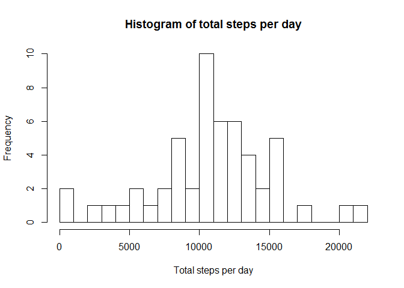
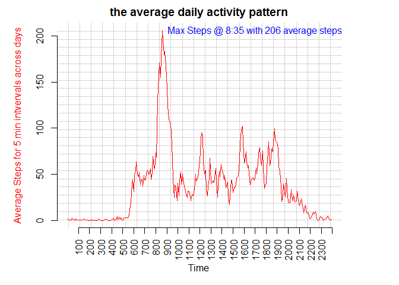
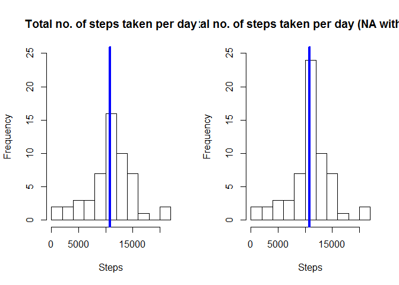
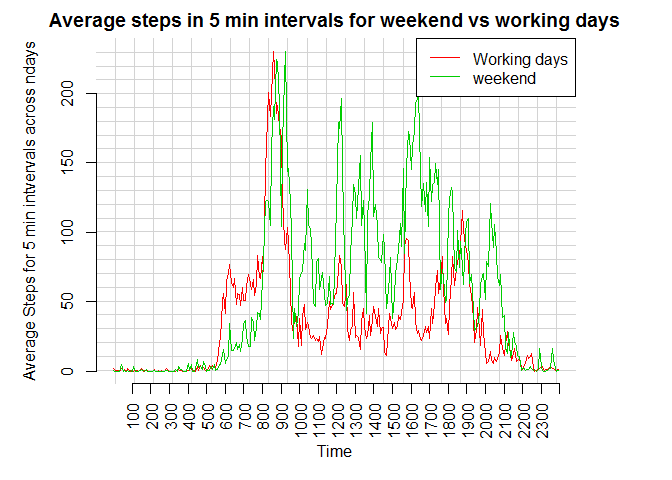

# Reproducible Research: Peer Assessment 1
## Krishnamurthy Baskar


## Loading and preprocessing the data
The provided data is in Zip format, hence unzip first.
Read the CSV data file
Examine the structure of the data read.


```r
unzipfile <- unzip("repdata-data-activity.zip")
activity <- read.csv(unzipfile)
str(activity)
```

```
## 'data.frame':	17568 obs. of  3 variables:
##  $ steps   : int  NA NA NA NA NA NA NA NA NA NA ...
##  $ date    : Factor w/ 61 levels "2012-10-01","2012-10-02",..: 1 1 1 1 1 1 1 1 1 1 ...
##  $ interval: int  0 5 10 15 20 25 30 35 40 45 ...
```

We can find the date column is not stored as date, hence it needs to be converted as date.
examine the structure again

```r
activity$date <- as.Date(activity$date)
str(activity)
```

```
## 'data.frame':	17568 obs. of  3 variables:
##  $ steps   : int  NA NA NA NA NA NA NA NA NA NA ...
##  $ date    : Date, format: "2012-10-01" "2012-10-01" ...
##  $ interval: int  0 5 10 15 20 25 30 35 40 45 ...
```


## What is mean total number of steps taken per day?

is there any missing values?

```r
sum(is.na(activity$steps))
```

```
## [1] 2304
```

Since there is missing values, prepare a new dataset excluding the missing values, which effectively ignores the missing values with ease.

```r
activityrm = activity[which(!is.na(activity$steps)),]
```

Calculate the total number of steps taken per day

```r
activity.sum <- tapply(activityrm$steps, activityrm$date, FUN=sum)
```

Below is the histogram of total number of steps taken each day

```r
hist(activity.sum, 
     breaks=round(max(activity.sum)/1000),
     main="Histogram of total steps per day",
     xlab="Total steps per day")
```

 

Calculate the mean and median of the total number of steps taken per day
we find:
    mean   = 10766.19
    median = 10765

```r
mean(activity.sum)
```

```
## [1] 10766.19
```


```r
median(activity.sum)
```

```
## [1] 10765
```

## What is the average daily activity pattern?

in order for the plot, summarise the average number of steps for the 5 minute interval, across all days.

```r
activity.intervalmean <- tapply(activityrm$steps, activityrm$interval, FUN=mean)
```

plot the 5 min intervals in X axis, however since there is too many such 5 minutes, break them for each hour in x axis
plot The average steps for 5 min interval in y axis (100 is 1:00 am etc. from 0:00 till 24:00)
calculate the 5 min interval in which the maximum steps taken and mark the point in the graph


```r
par(mar = c(5,5,2,5))
plot(activity.intervalmean, 
     col=2, 
     type="l",
     main="the average daily activity pattern",
     xlab=NA,
     ylab=NA,
     axes=FALSE,
     panel.first = grid(25, lty = 1, lwd = 1)
)
axis(2)
rn = rownames(activity.intervalmean)
max_x = which(activity.intervalmean == max(activity.intervalmean))
max_y = max(activity.intervalmean)
max_label = paste("Max Steps @ 8:35 with", round(max_y), "average steps")

axis(1, at=seq(13,dim(activity.intervalmean)+12, by=12), labels=rn[seq(13,dim(activity.intervalmean)+12, by=12)], las=3)
text(max_x, max_y, max_label, cex=1, pos=4, col="blue")

mtext(side=1, line=3, "Time")
mtext(side=2, line=3, "Average Steps for 5 min intvervals across days", col=2)
```

 

## Imputing missing values
As we already seen the supplied dataset has some missing (#2304) values in steps.


```r
activityNew <- activity
dim(subset(activityNew, is.na(activityNew$steps)))   # 2304
```

```
## [1] 2304    3
```

In this part, we create a new dataset 'activityNew' and replace the missing values with the mean for the 5 min interval.


```r
for (i in 1:dim(activity.intervalmean))
{
#  i=2
  activityNew[activityNew$interval 
           == as.numeric(rownames(cbind(activity.intervalmean[ i ])))
           & is.na(activityNew$steps), 1] <- activity.intervalmean[ i ]
}

summary(activityNew)
```

```
##      steps             date               interval     
##  Min.   :  0.00   Min.   :2012-10-01   Min.   :   0.0  
##  1st Qu.:  0.00   1st Qu.:2012-10-16   1st Qu.: 588.8  
##  Median :  0.00   Median :2012-10-31   Median :1177.5  
##  Mean   : 37.38   Mean   :2012-10-31   Mean   :1177.5  
##  3rd Qu.: 27.00   3rd Qu.:2012-11-15   3rd Qu.:1766.2  
##  Max.   :806.00   Max.   :2012-11-30   Max.   :2355.0
```


No missing value now

```r
sum(is.na(activityNew))
```

```
## [1] 0
```

Lets make the similar Histogram like earlier with both data 1)without fixing the missing values, 2) with the missing values fixed and examime whether the replacing with values made any  difference.


```r
activityNew.sum <- tapply(activityNew$steps, activityNew$date, sum)
par(no.readonly = TRUE)
```


```r
par(mfrow=c(1,2))
hist(activity.sum, 10, main = "Total no. of steps taken per day", 
     xlab = "Steps", 
     ylim =c(0, 25))
abline(v = median(activity.sum), 
       col = 4, 
       lwd = 4)
hist(activityNew.sum,10, 
     main = "Total no. of steps taken per day (NA with mean)", 
     xlab = "Steps",
     ylim =c(0, 25))
abline(v = median(activityNew.sum), 
       col = 4, 
       lwd = 4)
```

 

calculate the mean and median total number of steps taken per day with the new dataset.
With the below results we can see that the mean and median now and before do not differ much, the median moved a bit closer to the mean and hence the impact is not considerable.


```r
activityNew.sum <- tapply(activityNew$steps, activityNew$date, sum)

paste("the mean is ", mean(activityNew.sum))
```

```
## [1] "the mean is  10766.1886792453"
```

```r
paste("the median is ", median(activityNew.sum))
```

```
## [1] "the median is  10766.1886792453"
```

```r
paste("the difference now is ", median(activityNew.sum) - median(activity.sum))
```

```
## [1] "the difference now is  1.1886792452824"
```


## Are there differences in activity patterns between weekdays and weekends?

In this part we add factor variable 'weekend' with two level : 'working day' and 'weekend' based on the date in the dataset, 

```r
#activityNew$weekdays = weekdays(activityNew$date)

activityNew$weekend = ifelse(weekdays(activityNew$date) == "Saturday" 
                             | weekdays(activityNew$date) == "Sunday", 
                             "Weekend", "Working day")
```

create now summries of total number of steps taken per 5 min time interval for 'working day' and 'weekend'

```r
activityNew.intervalworkingday <- tapply(activityNew[activityNew$weekend == "Working day",]$steps, activityNew[activityNew$weekend == "Working day",]$interval, FUN=mean, na.rm=TRUE)

activityNew.intervalweekend    <- tapply(activityNew[activityNew$weekend == "Weekend",]$steps,     activityNew[activityNew$weekend == "Weekend",]$interval,     FUN=mean, na.rm=TRUE)
```

plot the the two (working days and weekend) in the same graph for easy of visual comparision and examine the plot for differences.

```r
par(mfrow=c(1,1))
par(mar = c(5,5,2,5))
plot(activityNew.intervalworkingday, 
     col=2, 
     type="l",
     main="Average steps in 5 min intervals for weekend vs working days",
     xlab=NA,
     ylab=NA,
     axes=FALSE,
     panel.first = grid(25, lty = 1, lwd = 1)
)
axis(2)
rn = rownames(activityNew.intervalworkingday)

axis(1, at=seq(13,dim(activityNew.intervalworkingday)+12, by=12), labels=rn[seq(13,dim(activityNew.intervalworkingday)+12, by=12)], las=3)

mtext(side=1, line=3, "Time")
mtext(side=2, line=3, "Average Steps for 5 min intvervals across ndays", col=1)

par(new=TRUE)

plot(activityNew.intervalweekend, 
     col=3, 
     type="l",
     main=NA,
     xlab=NA,
     ylab=NA,
     axes=FALSE
)

legend("topright", c("Working days", "weekend"), lty=1, col=2:3, )
```

 


There are differences in the walking style during working days and weekends.
first observation is this person walks for a the whole day throughout the week in general.
This person walks even more in the weekends. 

The cleaning of missing data did not make much difference, as we have seen earlier.
